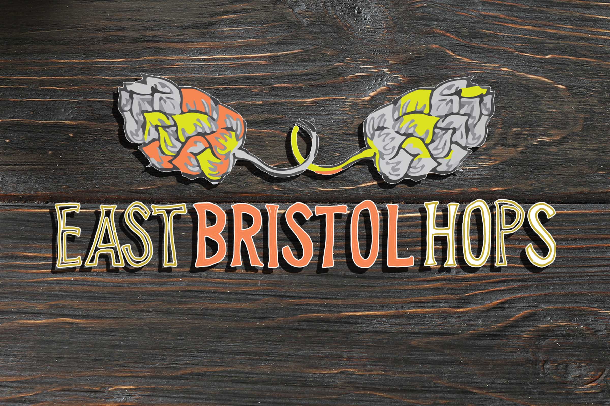

<h1 align="center">
   
 </h1>
 

    
#### Click on image for live version

# eastbristolhops
A website for a community hops growing association, that collectively grow hops in gardens and allotments.

Then a special green hopped beer is produced by a local bristol brewery Dawkins Ales

#### Visitors to this website are searching for:
* Information on what the association is all about.
* How to join.
* Details on how to grow hops.
* Signup to newsletter.

#### The Business potentials of this website are:
* Selling advertising space to businesses with beer or hops related products.
* Become an eCommerce site selling merchandise such as clothing.

#### This Website is the best way to help them achieve these things because:
* Other websites are too cluttered and hard to navigate.
* The site has clear navigation to guide the user to designated places.
* The user can easly sign up to the newletter via a pop up modal.
* The user can easly find the social media links clearly displayed on ther footer of every page.
* The contact for is clean and clear with easy to use fields.

#### This website is:
* Uncluttered and has an intuitive process of navigation.
* Providing clean and clear infomation on all pages.

## Features:
* All pages have a navigation bar across the top with links to home, HopsWiki , about and contact.
* Javascript contact page that sends messages stright to the assosciation email.
* A scroll to top button that appears when any page has been scrolled more than 100 pixels.
* A pop up banner asking the user to sign up to the mailing list.
* Footer contains social media links and copyright information.

#### Navigation: 
All pages contain the same navigation across the top and a footer to the bottom of the page. The top navigation bar consists of Home, HopsWiki, the East Bristol Hops logo that redirects to the home page when clicked, about and Contact links. All direct the user to the relevant locations. The footer contains social media links and copyright information. Easch page also contains a back to top button that appears on the right hand side of the screen when the page is scrolled.

#### Home:
The landing page has navigation across the top and footer across the bottom, 
a welcome message just below the navigation bar, followed by the East Bristol Hops Logo, followed by so what's it all about section, 
than a want to know more section below that with links to the about page. At the very bottom of this page is a website developed by 
section with a think to the developer's website.

#### HopsWiki:
The HopsWiki page has navigation across the top and footer across the bottom, a background image displaying hops and a grey semi-transparent box overlay containing the page information that consists of, clear section headers Ita all about hops, What are hops, Bine or Vine, Growing Hops.
the growing hops section has subheaders, Location, Sowing and Planting, How to test soil ph, Climbing Structure & Maintenance 
and Harvest Time. The how to test soil ph section has a button, on click will display 2 videos, one about soil ph and the other on how to use 
a ph meter, on click of the button a second time will hide the videos.

#### About:
The About page has navigation across the top and footer across the bottom, a background image displaying the first party's images and a grey semi-transparent box overlay containing the page information that consists of, clear section headers, How to become part of our community, Where it all began, whats this beer all about and a having trouble with alcohol section.
The How to become part of our community section also consists of links to the social media pages of Facebook and twitter but also the contact page.
Where it all began has images and a story of where and how the project started.
Whats this beer all about contains pictures and information about the beer.
Having trouble with alcohol contains 2 links one to Drinkaware and the other to  Alcoholics anonymous.

#### Contact:
The Contact page has navigation across the top and footer across the bottom, with a form across the middle of the page and a submit button below that. On submit, an overlay with hops image spinning around and loading please wait is displayed while the information is being sent to via the emailJS API, once the information is sent the overlay clears and a thank you, we have received your email message is injected via javascript. The API is linked to the East Bristol Hops email account so all correspondence from the website is sent to that inbox.

bine or vine.
Infomation from https://abushelofhops.co.uk/news/dried-hop-vines-v-dried-hop-bines-whats-difference/

what are hops.
Infomation from https://www.britishhops.org.uk/hops/what-is-a-hop/

scroll to top icon
https://paulund.co.uk/how-to-create-an-animated-scroll-to-top-button-with-jquery

Images 
images of the pots and hops belong to Jon Wheway
Hops on th string Photo by ELEVATE from Pexels
Hops trellis photo from East Bristol Hops Twitter 
© Rido 209712791 Purchased from Adobe stock
favicon.ioc Unknone artist https://www.clipart.email/download/19281353.html

Fonts
Unkempt & Cuprum google fonts licenced under Open Font Licence.
